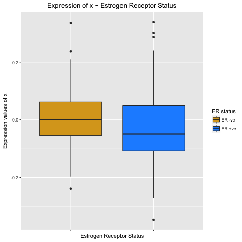

```{r, message=FALSE}
library(dplyr)
library(ggplot2)
library(RColorBrewer)
```


#4. Programming in R

## Motivation
Typically when we perform an analysis we want to perform the same analysis/steps on either multiple genes/samples/datasets.

With the basic analysis and graphs that we have created in the previous sessions it is possible to
copy and paste the relevant section of code and adjust the code.

However, consider the scenario where you have a script of several hundred lines to anaysis a patient/
dataset.

Whilst you could copy that script and adjust the variables for each patient/dataset. However,
this method of copying, pasting and editting can be:
    1. Tedious
    2. Erroreous
    

## Copy/Paste/Edit example
Take the scenario where you want to identify the number of the genes on the 
following chromosomes:  
        Chromosomes 1, 5, 6, 8
```{r}
patients <-  read.delim("updated.patient.txt", stringsAsFactors = FALSE)
exprsAnno <- read.delim("anno.gene.expression.txt", stringsAsFactors = FALSE)
### Insert your code here ###
```


## Copy/Paste/Edit example 2
Whilst the first example only contains 3 lines of code, and therefore is less likely to lead to errors
imagine that you want to create multiple boxplots.

For example below is the code to create histograms for the expression values of the following genes
    - FOXE1  
    - TECTA  
    - BAX  
    - MAP3K8  
    - GEMIN8
```{r}
tmp <- exprsAnno %>% 
    filter(HUGO.gene.symbol == "FOXE1") %>% 
    select(starts_with("NKI")) %>%
    t() %>%
    data.frame()
colnames(tmp) <- "FOXE1"
g <- ggplot(tmp, aes(y = FOXE1, x = factor(patients[, "er"]), fill = factor(patients[, "er"]))) +
    geom_boxplot() + 
    scale_fill_manual(values = c("goldenrod", "dodgerblue"),
                      name = "ER status",
                      labels = c("ER -ve", "ER +ve")) +
    labs(title = "Expression of FOXE1 ~ Estrogen Receptor Status",
         x = "Estrogen Receptor Status",
         y = "Expression values of FOXE1") +
    scale_x_discrete(labels = NULL) + 
    theme(plot.title = element_text(hjust = 0.5))
print(g)

```

or
```
exprsAnno %>% 
    filter(Chromosome == "chr8") %>%
    select("NKI_7") %>% 
    ggplot(aes(x = NKI_7, fill = as.factor("NKI_7"))) +
    geom_histogram() +
    scale_fill_manual(values = "goldenrod", guide = "none") +
    labs(title = "Expression of chr8 for patient NKI_7",
         y = "Count",
         x = "Expression values")
```
```{r, eval=FALSE}
tmp <- exprsAnno %>% 
    filter(HUGO.gene.symbol == "TECTA") %>% 
    select(starts_with("NKI")) %>%
    t() %>%
    data.frame()
colnames(tmp) <- "TECTA"
g <- ggplot(tmp, aes(y = TECTA, x = factor(patients[, "er"]), fill = factor(patients[, "er"]))) +
    geom_boxplot() + 
    scale_fill_manual(values = c("goldenrod", "dodgerblue"),
                      name = "ER status",
                      labels = c("ER -ve", "ER +ve")) +
    labs(title = "Expression of TECTA ~ Estrogen Receptor Status",
         x = "Estrogen Receptor Status",
         y = "Expression values of TECTA") +
    scale_x_discrete(labels = NULL) + 
    theme(plot.title = element_text(hjust = 0.5))
print(g)

tmp <- exprsAnno %>% 
    filter(HUGO.gene.symbol == "BAX") %>% 
    select(starts_with("NKI")) %>%
    t() %>%
    data.frame()
colnames(tmp) <- "BAX"
g <- ggplot(tmp, aes(y = BAX, x = factor(patients[, "er"]), fill = factor(patients[, "er"]))) +
    geom_boxplot() + 
    scale_fill_manual(values = c("goldenrod", "dodgerblue"),
                      name = "ER status",
                      labels = c("ER -ve", "ER +ve")) +
    labs(title = "Expression of BAX ~ Estrogen Receptor Status",
         x = "Estrogen Receptor Status",
         y = "Expression values of BAX") +
    scale_x_discrete(labels = NULL) + 
    theme(plot.title = element_text(hjust = 0.5))
print(g)

# ETC....
```

As you can imagine the more lines of code that need to be copied/pasted and editted the more likely
it is that errors will arise.

## Loops: Commands and flow control
- Many programming languages have ways of doing the same thing many times, perhaps changing some variable each time. This is called **looping**

- As we are doing the same thing multiple times, but with a different index each time, we can use a **loop** instead
- R has two basic types of loop
    + a **`while`** loop: run some code while some condition is true 
    (*hardly ever used! Therefore will not be covered*)
    + a **`for`** loop: run some code on every value in a vector
    
`for` 
The basic structure of a `for` loop:
```
for (element in vector){
    ... do this ...
}

```

- Therefore the code is only run for as many elements are in the vector. Therefore we can predict the number of times the code is run

- Note: *element* and *vector* are just variable names and can therefore be named whatever you want
them to be, as long as they satisfy the constriants on varible naming.

- Here's how we might use a `for` loop to find out the number of genes on each chromosome.

```{r}
chrom <- c("chr1", "chr5", "chr6", "chr8")

for (chr in chrom){
    numRows <- exprsAnno %>%
        filter(Chromosome == chr) %>%
        summarise(n())
    s <- paste("The number of genes on", chr, "is", numRows)
    print(s)
}

```

- The above for loop finds out the same information that we identified earlier by
copying/pasting/editting
- Though the more accurately depict the operations of a `for` loop the code is more similar to the
following:
```{r}
chr <- "chr1"
numRows <- exprsAnno %>% filter(Chromosome == chr) %>% summarise(n())

chr <- "chr5"
numRows <- exprsAnno %>% filter(Chromosome == chr) %>% summarise(n())

chr <- "chr6"
numRows <- exprsAnno %>% filter(Chromosome == chr) %>% summarise(n())

chr <- "chr8"
numRows <- exprsAnno %>% filter(Chromosome == chr) %>% summarise(n())
```

## Exercise
Find the number of patients who are aged above 20, 30, 40, and print the answer to the console.
```{r}
ages <- c(20, 30, 40)
### Insert your code here ###
```

## Exercise
Convert the code used to generate the boxplots in the second example of copy/paste/edit
into a `for` loop

Which variables are you looping over?

Hint: Consider using the function `paste()` to help change the y-axis label and title to reflect the
gene that is being plotted

# Saving multiple plots
You can save all the plots produced by a `for` loop by using the `pdf()` function *outside* the `for`loop.
This will create one file with all the plots.

Otherwise, another option is to create a png/jpeg file for each graph *inside* the `for` loop.

## Storing results

Note that this `for` loop is helping us identify the number of genes in each chromosome but the
result is not stored. Thus, we can not access the results at a later time.

- When storing the results from a loop, we often create an empty variable before starting the for loop
- This is used store the result at each iteration of the loop

```{r}
numGenes <- NULL
chrom <- c("chr1", "chr5", "chr6", "chr8")
for(chr in chrom) {
  numRows <- exprsAnno %>%
      filter(Chromosome == chr) %>%
      summarise(n())
  numGenes[chr] <- numRows
  }
numGenes
```


## Exercise
Identify the number of patients who are positive for ER/PR/HER2 when considering each status
individually. Store the results in a vector.

```{r}
status <- c("er", "pr", "her2")
### Your answer here ###
```


##Conditional branching: Commands and flow control

- Use an `if` statement for any kind of condition testing
- Different outcomes can be selected based on a condition within brackets

```
if (condition) {
  ... do this ...
  } else {
    ... do something else ...
    }
```

- `condition` is any logical value, and can contain multiple conditions. 
    + e.g. `(a == 2 & b < 5)`, this is a compound conditional argument
- The condition should return a *single* value of `TRUE` or `FALSE`

    
## Other conditional tests

- There are various tests that can check the type of data stored in a variable
    + these tend to be called **`is...()`**. 
        + try *tab-complete* on `is.`

```{r}
is.numeric(10)
is.numeric("TEN")
is.character(10)
```

- `is.na()` is useful for seeing if an `NA` value is found
    + cannot use `== NA`!

```{r}
x <- c(1, 2, NA)
mean(x)
is.na(x)
```

## Exercise
Run the line of code below.
```{r}
x <- rnorm(1, mean = 50, sd = 10)
```
This line picks a random number from a "normal" distribution (AKA the bell curve). As it is random
everyone will get a different answer!!

Write an `if` statement to check if the number generated is *greater than or equal* to 50.
If so then print: "The number is greater than or equal to 50"
`else` print: "The number is less than 50""

## Example
Checking if a gene of interest is in the dataset
    - There are 2 methods that could be used to achieve this
    1. Make uses of the functions `all()` and `any()`
    2. Make use of the function `sum()`
```{r}
## Method 1
if (any(exprsAnno$HUGO.gene.symbol == "PIK3CA")){
    print("PIK3CA is in the dataset")
}else{
    print("PIK3CA is not in the dataset")
}

## Method 2
if (sum(exprsAnno$HUGO.gene.symbol == "PIK3CA") == 1){
    print("PIK3CA is in the dataset")
}else{
    print("PIK3CA is not in the dataset")
}
```

## Exercise
Write an `if else` statement to check if *all* of the following genes are in the dataset:
BCL2, HOXA9, MAPK1, ARID1A, GATA3, ESR1

Hint: Make use of `%in%`


## Other useful conditionals
`file.exists()`, `dir.exists()` and `dir.create()` are also functions that are useful in `if else` statements.
Particularly, when writing scripts that take inputs from the commandline.


## Combining Loops and Conditional branching
Using the **`for`** loop we wrote before, we could add an `if else` branch to identify if the difference
between the mean expression for a gene differs between the groups ER positive/negative.

We are interested in finding out if the following genes:  
AMPD3, TECTA, TRPV4, CD244, ABHD10, GEMIN8, MAP1A, SMAD7
have difference between the ER status of greater than 0.04.

- Here's how we can use an `if` statement to test for this
    + for each iteration of the the loop:
        1. Identify the expression values associated with the gene of interest
        2. Group the samples based on there ER status, and find the mean for each group
        3. if the absolute difference is greater than 0.04, print a statement that informs us of this
        4. else, do nothing
```{r}
genes <- c("AMPD3", "TECTA", "TRPV4", "CD244", "ABHD10", "GEMIN8", "MAP1A", "SMAD7")

for (gen in genes){
    tmp <- exprsAnno %>%
        filter(HUGO.gene.symbol == gen) %>%
        select(starts_with("NKI")) %>%
        t() %>%
        data.frame()
    colnames(tmp) <- "gene"
    x <- tmp %>% 
        group_by(factor(patients[, "er"])) %>%
        summarise("exprsAv" = mean(gene, na.rm = TRUE))
    diff <- x$exprsAv[1] - x$exprsAv[2]
    if (abs(diff) > 0.04){
        print(paste("The difference between ER status for", gen, "is", abs(diff), "which is greater than 0.04"))
    }else{
        print(paste("The difference between ER status for", gen, "is not greater than 0.04"))
    }
}

```

Whilst it is slightly informative to know that the difference between means of ER status for each gene.
It would be more interesting to plot the expression of the genes that have an absolute difference of
greater than 0.04.

Therefore we want to take the same steps as above but change from printing a statement to plotting a graph
- Here's how we can use an `if` statement to test for this
    + for each iteration of the the loop:
        1. Identify the expression values associated with the gene of interest
        2. Group the samples based on there ER status, and find the mean for each group
        3. if the absolute difference is greater than 0.04, **produce a boxplot to depict the difference**
        4. else, do nothing
        
```{r}
genes <- c("AMPD3", "TECTA", "TRPV4", "CD244", "ABHD10", "GEMIN8", "MAP1A", "SMAD7")

for (gen in genes){
    tmp <- exprsAnno %>%
        filter(HUGO.gene.symbol == gen) %>%
        select(starts_with("NKI")) %>%
        t() %>%
        data.frame()
    colnames(tmp) <- "gene"
    x <- tmp %>% 
        group_by(factor(patients[, "er"])) %>%
        summarise("exprsAv" = mean(gene, na.rm = TRUE))
    diff <- x$exprsAv[1] - x$exprsAv[2]
    if (abs(diff) > 0.04){
        g <- ggplot(tmp, aes(y = gene, x = factor(patients[, "er"]), fill = factor(patients[, "er"]))) +
            geom_boxplot()
        print(g)
    }else{
        next
    }
}
```

## Exercise
Add additional layers to the above plot so that the labels are more informative.
See plot below, replace "x" in the labs for the gene that we are investigating:  
Also, change the colours associated with each ER status.



##Code formatting avoids bugs!
Compare:
```{r eval=FALSE}
for (a in ages){
numRows <- patients %>%
filter(age > a) %>%
summarise(n())
if(numRows < 10){
s <- paste("There are fewer than 10 patients younger than", a)
print(s)
}else{
s <- paste("There are more than 10 patients younger than", a)
print(s)
}
}
```
to:
```{r eval=FALSE}
for (a in ages) {
    numRows <- patients %>%
        filter(age > a) %>%
        summarise(n())
    if (numRows < 10) {
        s <- paste("There are fewer than 10 patients younger than", a)
        print(s)
    } else{
        s <- paste("There are more than 10 patients younger than", a)
        print(s)
    }
}
```
- The code between brackets `{}` *always* is *indented*, this clearly separates what is executed once, and what is run multiple times
- Trailing bracket `}` always alone on the line at the same indentation level as the initial bracket `{`
- Use white spaces to divide the horizontal space between units of your code, e.g. around assignments, comparisons

