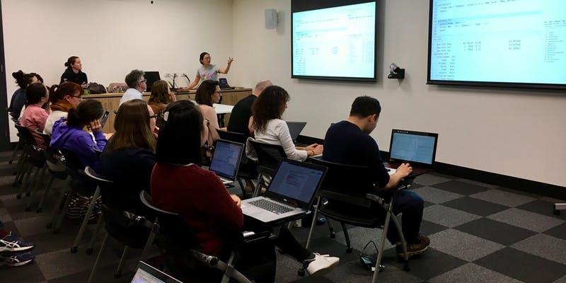

## Course Description
This course provides an introduction to the R programming language and software environment for statistical computing and graphics. A variety of examples with a biological theme will be presented.

## Topics Covered
### Week 1
- R environment
- Informal introduction to R basics
- Understanding data types

### Week 2
- Basic built-in functions for data manipulation
- Reading and writing data tables
- Basic R graphics

### Week 3
- dplyr package for data manipulation
- ggplot2 package for plotting
- Customized plotting functions

### Week 4
- Data analysis and R automation with examples
- Functions as procedures
- Functions with arguments

## Acknowledgements
This course is based on the R course run regularly at the University of Cambridge through the Bioinformatics Training Facility:
[http://training.csx.cam.ac.uk/bioinformatics/course/bioinfo-rintro](http://training.csx.cam.ac.uk/bioinformatics/course/bioinfo-rintro)

## Useful Resources

+ [The R Project for Statistical Computing](http://www.r-project.org/)
+ [Bioconductor](http://www.bioconductor.org/)
